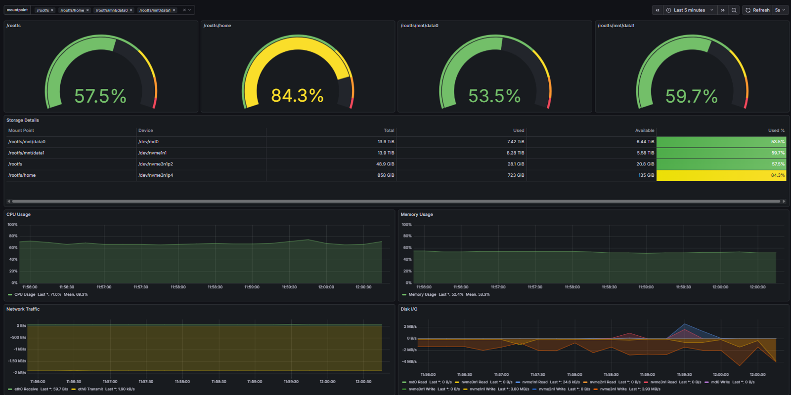

# Server Monitor



A dynamic server monitoring dashboard using Prometheus, Node Exporter, and Grafana. Monitors CPU, memory, network, disk I/O, and storage usage with automatic drive detection and configurable alerts.

## Components

- **Prometheus**: Collects and stores metrics
- **Node Exporter**: Exposes system metrics
- **Grafana**: Visualizes metrics in a dashboard

## Prerequisites

- Docker and Docker Compose installed
- Linux server with the drives you want to monitor

## Deployment

### 1. Clone or Copy Repository

```bash
git clone <repository-url>
cd server_monitor
```

### 2. Configure Environment Variables

Create a `.env` file:

```bash
NODE_EXPORTER_CONTAINER=node-exporter-c
NODE_EXPORTER_PORT=9100

PROMETHEUS_CONTAINER=prometheus-c
PROMETHEUS_PORT=9090

GRAFANA_CONTAINER=grafana-c
GRAFANA_PORT=3000
GRAFANA_ROOT_URL=http://YOUR_HOSTNAME:3000

SLACK_WEBHOOK_URL=https://hooks.slack.com/services/YOUR/WEBHOOK/URL
```

Replace:
- `YOUR_HOSTNAME` with your server's hostname or IP address (e.g., `server01` or `192.168.1.100`)
- `SLACK_WEBHOOK_URL` with your actual Slack webhook URL for alert notifications

**Important Notes**:
- Setting `GRAFANA_ROOT_URL` ensures that links in Slack notifications point to your server's hostname instead of localhost
- If you change `GRAFANA_PORT`, make sure to update the port number in `GRAFANA_ROOT_URL` to match (e.g., if `GRAFANA_PORT=4000`, then `GRAFANA_ROOT_URL=http://YOUR_HOSTNAME:4000`)

### 3. Configure Alerts

Edit `config/alerts_config.json` to customize alert thresholds and notification intervals:

```json
{
  "check_interval": "10s",
  "storage_alerts": {
    "enabled": true,
    "threshold_percent": 90,
    "evaluation_interval": "5m",
    "notification_interval": "24h"
  },
  "cpu_alerts": {
    "enabled": true,
    "threshold_percent": 80,
    "sustained_duration": "10m",
    "notification_interval": "1h"
  },
  "memory_alerts": {
    "enabled": true,
    "threshold_percent": 90,
    "sustained_duration": "5m",
    "notification_interval": "1h"
  }
}
```

Configuration options:
- **check_interval** (global): How often Grafana evaluates all alerts (default: `10s`)
- **enabled**: Enable or disable alerts for this metric type
- **threshold_percent**: Percentage threshold that triggers the alert
- **sustained_duration**: How long the threshold must be exceeded before firing the alert
- **notification_interval**: How often to resend Slack notifications while an alert is active

**Understanding notification_interval:**
This controls how frequently you receive Slack notifications while an alert is firing.


Valid duration formats: `10s`, `20s`, `30s`, `1m`, `5m`, `1h`, `24h`

### 4. Generate Alerts

Generate alert rules from the configuration:

```bash
python3 generate_alerts.py
```

This generates:
- `config/alert_rules.yml` - Grafana alert rules
- `config/notification_policies.yml` - Notification timing policies

**Note**: The dashboard is fully dynamic and doesn't need regeneration. Alerts automatically monitor all physical drives.

### 5. Start Services

```bash
docker compose up -d
```

### 6. Access Grafana

Open your browser and navigate to `http://<server-ip>:<port>` where `<port>` is the value you set for `GRAFANA_PORT` in your `.env` file (default: 3000).

Default credentials:
- Username: `admin`
- Password: `admin`

The dashboard "Server Monitor - Dynamic" should be automatically loaded and will show all your filesystems!

Note: If you changed `GRAFANA_PORT` to something other than 3000 (e.g., 4000), you'll access Grafana at that port on the host, but the container internally still runs on port 3000.

### 7. Select Which Drives to Monitor (Optional)

In the Grafana dashboard, use the "mountpoint" dropdown at the top to select which filesystems you want to see in the storage gauges. By default, all non-tmpfs filesystems are shown.

## User Access Options

The dashboard is configured with **anonymous read-only access** enabled, making it easy for users to view metrics without logging in.

### Option 1: Direct Access (Current Setup)
Users can access the dashboard at:
```
http://jc-compute01:3000
```

- No login required for viewing dashboards
- Admin access still available at the login page (username: `admin`, password: `admin` - change on first login)

### Option 2: Share Direct Dashboard Link

Get the direct link to your dashboard:
1. Open the dashboard in Grafana
2. The URL will be: `http://jc-compute01:3000/d/server-monitor/server-monitor-dynamic`
3. Share this link with users

### Security Notes

- **Access is read-only** - users cannot modify dashboards or settings

## Dashboard Features

### Dynamic Drive Detection
The dashboard automatically detects and displays **all available filesystems** from Prometheus. No need to regenerate the dashboard when adding or removing drives!

### Interactive Controls
Use the **mountpoint dropdown** at the top of the dashboard to select which filesystems to monitor. Changes apply instantly without reloading.


## Updating Configuration

### Adding/Removing Monitored Drives

Dashboard and alerts discover drives dynamically.

- **Dashboard**: Use the dropdown to select which filesystems to display
- **Alerts**: Automatically monitor all physical drives (no configuration needed)

### Modifying Alert Settings

To change alert thresholds or notification intervals:

1. Edit `config/alerts_config.json`
2. Run `python3 generate_alerts.py`
3. Restart Grafana: `docker compose restart grafana`

## Monitoring Metrics

- **CPU Usage**: Overall CPU utilization percentage
- **Memory Usage**: Memory consumption percentage
- **Network Traffic**: Network I/O by interface (receive/transmit)
- **Disk I/O**: Disk read/write throughput for NVMe and MD devices
- **Storage**: Usage percentage, total, used, and available space for configured drives

## Alerts

The dashboard includes configurable alerts for:

- **Storage Alerts**: Triggered when any monitored drive exceeds the configured threshold (default: 90%). Notifications sent daily when active.
- **CPU Alerts**: Triggered when CPU usage exceeds the threshold for a sustained duration (default: 80% for 10 minutes). Notifications sent hourly.
- **Memory Alerts**: Triggered when memory usage exceeds the threshold for a sustained duration (default: 90% for 5 minutes). Notifications sent hourly.

All alerts send notifications to the configured Slack webhook URL. Alert thresholds, durations, and notification intervals are fully configurable via `config/alerts_config.json`.
